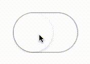

# MacToggle

Create Mac OS toggles with the user interaction, design and animation of the iOS UISwitch. Completely configurable through quick understandable code. With access to the source, you are able to add more custom features if you want. If their are any tweaks that you feel should be enabled then send me over a PR and I will have a look. **Swift 3 Ready**



## Setup

Nothing complicated, copy the MacToggle folder over to your project.


## Sample Code

```swift
let toggle: MacToggle = {
	let view = MacToggle()
	view.isOn = true
	view.fillColor = .black
	return view
}()
```
There are plenty of settings you can play with, have fun and create the designs that you require for your Mac OS developments. Here are a couple of designs, for ideas:


## Support

If you have any issues with the MacToggle, the shoot me an email <a href="mailto:rich@richappz.com?Subject=MacToggle%20Support" target="_top">rich@richappz.com</a>. If you have any additions to MacToggle then shoot me over a pull request and I will have a look.

## Todo

- Dragging on the toggle.
- Label support.


# License

***Available Under the MIT License***

>Copyright (c) 2016-2017 Rich Abery
>                    
>Permission is hereby granted, free of charge, to any person obtaining a copy of this software and associated documentation files (the "Software"), to deal in the Software without restriction, including without limitation the rights to use, copy, modify, merge, publish, distribute, sublicense, and/or sell copies of the Software, and to permit persons to whom the Software is furnished to do so, subject to the following conditions:
                    
>The above copyright notice and this permission notice shall be included in all copies or substantial portions of the Software.
                    
>THE SOFTWARE IS PROVIDED "AS IS", WITHOUT WARRANTY OF ANY KIND, EXPRESS OR IMPLIED, INCLUDING BUT NOT LIMITED TO THE WARRANTIES OF MERCHANTABILITY, FITNESS FOR A PARTICULAR PURPOSE AND NONINFRINGEMENT. IN NO EVENT SHALL THE AUTHORS OR COPYRIGHT HOLDERS BE LIABLE FOR ANY CLAIM, DAMAGES OR OTHER LIABILITY, WHETHER IN AN ACTION OF CONTRACT, TORT OR OTHERWISE, ARISING FROM, OUT OF OR IN CONNECTION WITH THE SOFTWARE OR THE USE OR OTHER DEALINGS IN THE SOFTWARE.
